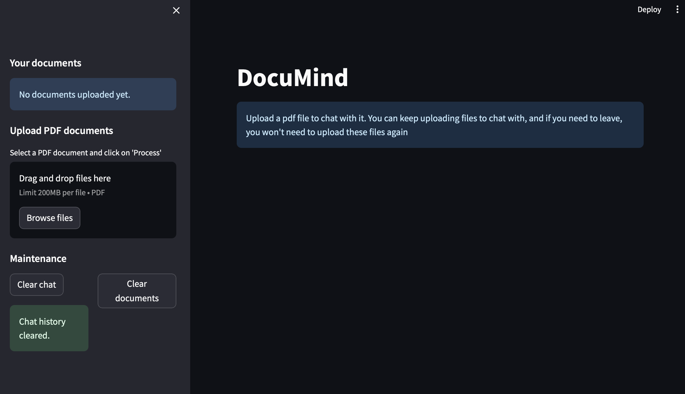
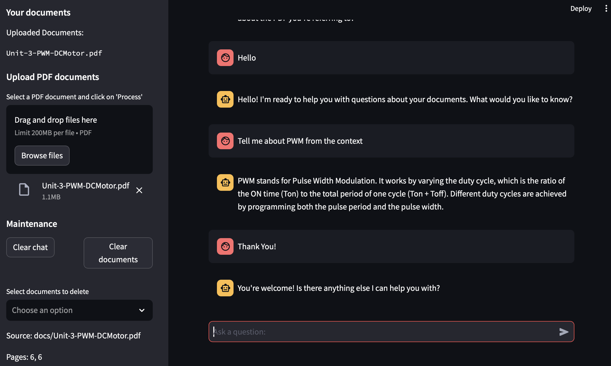

# 🧠 DocuMind – Your Intelligent PDF Chatbot

[](https://www.python.org/)  
[](https://streamlit.io/)  

---

## 🌟 Project Overview

**DocuMind** is a **smart, context-aware chatbot** designed to help you **interact with your PDFs like never before!** Unlike traditional chatbots that rely on general knowledge, DocuMind uses **Retrieval-Augmented Generation (RAG)** to **provide precise answers directly from your documents**.  

With DocuMind, you can:

- Ask **specific questions** about your PDFs.  
- Get **relevant answers with source references**.  
- Manage documents **easily via a sleek Streamlit interface**.  

📌 **Key Idea:**  
> "Upload your PDF → DocuMind understands it → Ask questions → Get accurate, traceable answers."  

---

## ⚡ Features

| Feature | Description |
|---------|-------------|
| 🧩 **Context-Aware Responses** | Answers are strictly based on uploaded PDFs, reducing hallucinations. |
| 🔄 **Multi-Turn Conversations** | Maintains chat history so follow-up questions are smooth. |
| 📂 **Document Management** | Upload, delete, or reset PDFs dynamically without restarting. |
| 📝 **Metadata Transparency** | Sidebar shows **source document & page numbers** for every response. |
| 💾 **Persistent Vector Database** | Chroma DB stores embeddings, so PDFs don’t need reprocessing. |
| 🖥️ **Interactive UI** | Beautiful Streamlit interface with chat input, sidebar, and management options. |

---

## User Interface



## 🏗️ Project Structure

```text
DocuMind/
├─ app.py                 # Main Streamlit app
├─ chatbot.py             # Chatbot logic and LLM integration
├─ save_docs.py           # PDF ingestion and embedding storage
├─ prepare_vectordb.py    # Prepare/load vector database
├─ session_state.py       # Streamlit session management
├─ requirements.txt       # Project dependencies
└─ .env                   # API keys
```
⸻

## 🧩 How DocuMind Works

1️⃣ Document Ingestion
	•	PDFs are uploaded via Streamlit.
	•	Text is extracted using PyPDFLoader.
	•	Large text is split into smaller chunks using RecursiveCharacterTextSplitter to fit LLM token limits.

2️⃣ Embedding Generation
	•	Each text chunk is converted into a vector embedding using GoogleGenerativeAIEmbeddings.
	•	Embeddings are stored in Chroma DB for semantic search.

3️⃣ Session Management
	•	Chat history, uploaded PDFs, and vector DB are stored in Streamlit session state, allowing multi-turn conversations and dynamic document updates.

4️⃣ Chat Interaction
	1.	Retrieve Context: Chroma DB fetches top relevant chunks.
	2.	Generate Response: Gemini 1.5 Pro uses retrieved context + chat history.
	3.	Display Response: Response is shown in chat, sidebar shows source PDF and page numbers.

5️⃣ Document Management
	•	Clear chat history ✅
	•	Delete individual PDFs ❌
	•	Reset entire vector database 🔄

---

## How the bot answers!



🛠️ Tech Stack

| Component            | Technology / Library                                |
|----------------------|----------------------------------------------------|
| **LLM**              | Gemini 1.5 Pro (`langchain_google_genai`)         |
| **Vector DB**        | Chroma DB (`chromadb`)                             |
| **PDF Loader**       | PyPDFLoader                                       |
| **Text Splitter**    | RecursiveCharacterTextSplitter                     |
| **Embeddings**       | GoogleGenerativeAIEmbeddings                       |
| **Chains & Prompts** | LangChain (`create_retrieval_chain`)              |
| **Frontend**         | Streamlit                                         |
| **Backend**          | Python                                           |
| **Environment**      | `python-dotenv` for API keys                     |

---

# ⌛️Steps to run the program

```bash
# 1️⃣ Clone the repository
git clone <your-repo-url>
cd <your-repo-folder>

# 2️⃣ Install dependencies
pip install -r requirements.txt

# 3️⃣ Create a .env file and add your api key
GOOGLE_API_KEY = "your_google_api_key_here"

# 4️⃣ Run the app
streamlit run app.py
